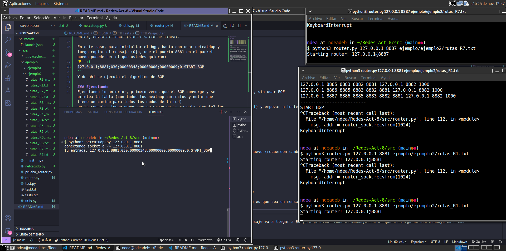
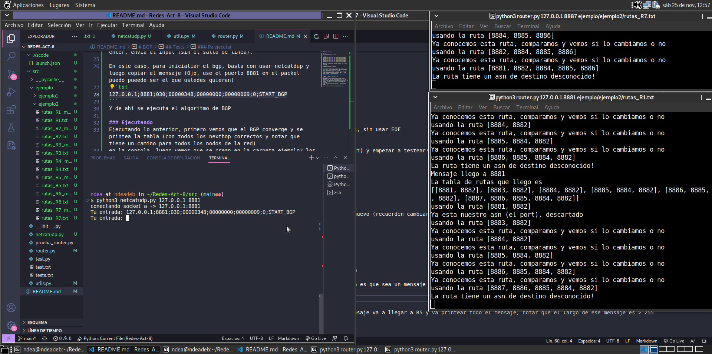
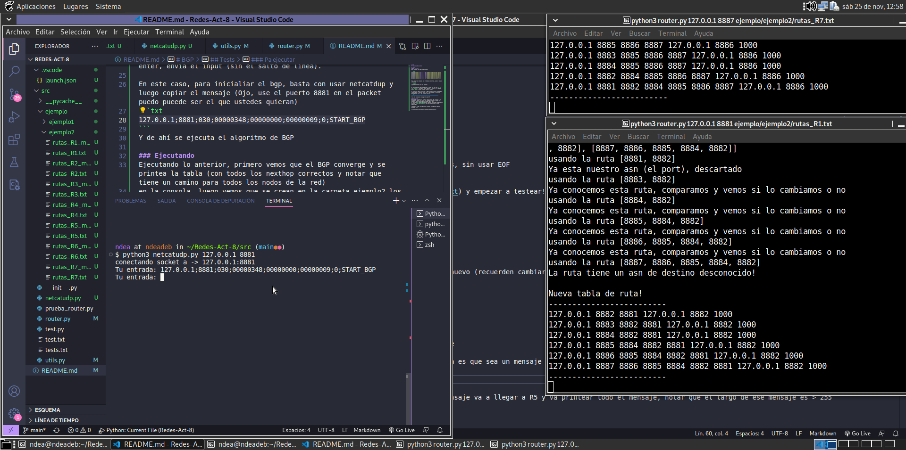
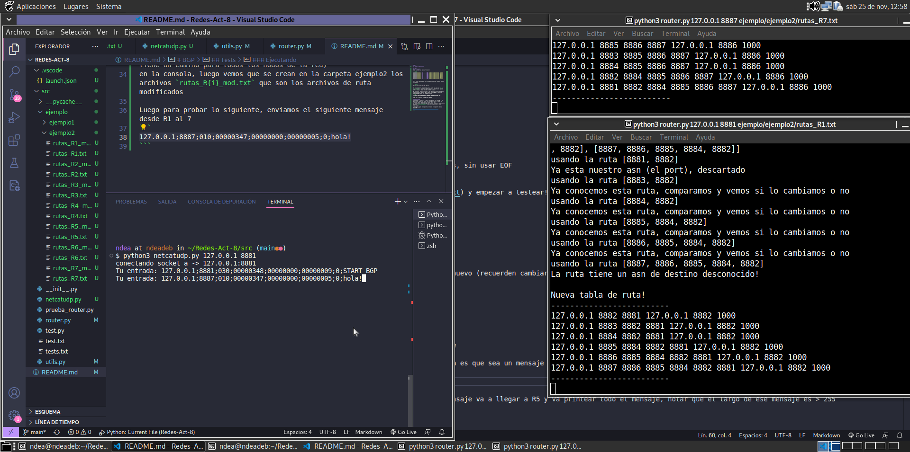
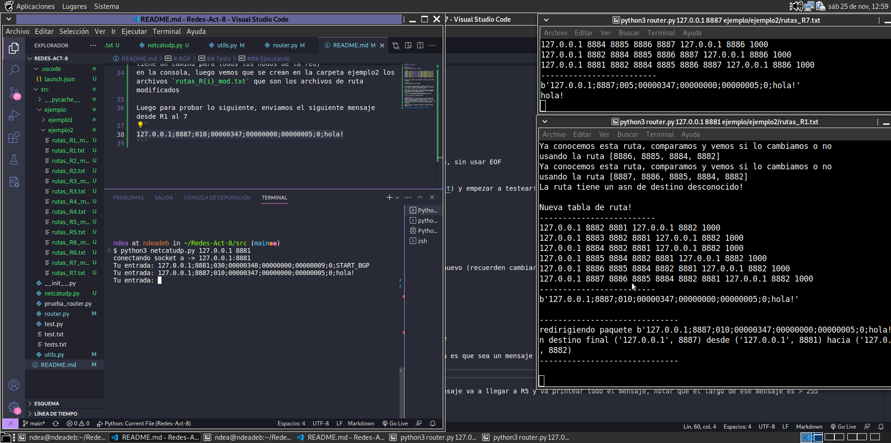

# BGP
## Codigo y desiciones

## Tests
### Pa ejecutar
Aqui esta el caso de los 7 routers!

```bash
python3 router.py 127.0.0.1 8881 ejemplo/ejemplo2/rutas_R1.txt
python3 router.py 127.0.0.1 8882 ejemplo/ejemplo2/rutas_R2.txt
python3 router.py 127.0.0.1 8883 ejemplo/ejemplo2/rutas_R3.txt
python3 router.py 127.0.0.1 8884 ejemplo/ejemplo2/rutas_R4.txt
python3 router.py 127.0.0.1 8885 ejemplo/ejemplo2/rutas_R5.txt
python3 router.py 127.0.0.1 8886 ejemplo/ejemplo2/rutas_R6.txt
python3 router.py 127.0.0.1 8887 ejemplo/ejemplo2/rutas_R7.txt
```

Para enviar un mensaje, por problemas con netcat, usen el modulo netcatudp

```python
python3 netcatudp.py <ip> <puerto>
```

El funcionamiento de netcatdup es la misma que que usar `nc -u <ip> <puerto>`, recibe un input (mensaje a enviar) y al apretar enter, envia el input (sin el salto de linea).

En este caso, para inicialiar el bgp, basta con usar netcatdup y luego copiar el mensaje (Ojo, use el puerto 8881 en el packet puedo pueede ser el que ustedes quieran)
```txt
127.0.0.1;8881;030;00000348;00000000;00000009;0;START_BGP
```
Y de ahí se ejecuta el algoritmo de BGP

### Ejecutando

__Importante__: En toda la secuencia de la imagenes, el terminal vscode es el netcat, el de la esquina superior derecha es el R7 y
el otro terminal es el R1.

Ejecutando lo anterior, primero vemos que el BGP converge y se printea la tabla en la consola, (con todos los nexthop correctos y notar que tiene un camino para todos los nodos de la red)



Luego vemos que se crean en la carpeta ejemplo2 los archivos `rutas_R{i}_mod.txt` que son los archivos de ruta modificados



Luego para probar lo siguiente, enviamos el siguiente mensaje desde R1 al 7
```
127.0.0.1;8887;010;00000347;00000000;00000005;0;hola!
```


Enviando el mensaje (ignoren el printeo de bytes, fue por debug)
vemos que el R7 printea hola, desde un mensaje que fue enviado desde 1.



Para no ser un festival de pantallasos los siguientes mensajes tambien funcionan: R7 -> R4 y R7 -> R3 (recuerden hacer netcat en el puerto 8887!)

```
127.0.0.1;8884;010;00000348;00000000;00000005;0;hola!
127.0.0.1;8883;010;00000349;00000000;00000005;0;hola!
```